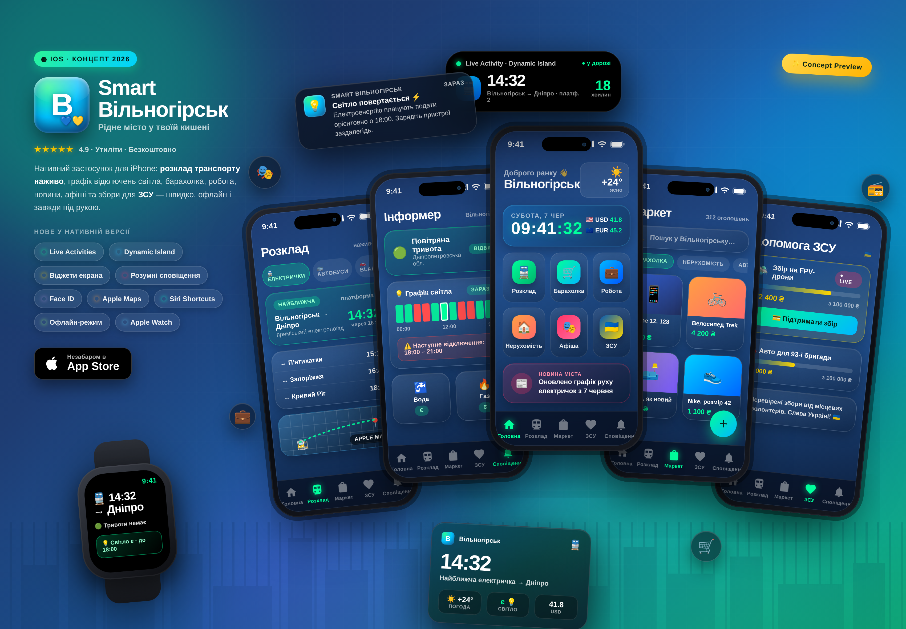

# Концепт нативного iOS-застосунку «Smart Вільногірськ»

Візуальний концепт (колаж) майбутнього нативного застосунку для iPhone на основі
наявного веб-порталу міста. Це макет/мудборд для презентації ідеї — не робочий код застосунку.

## Що показано

**5 екранів застосунку:**
- 🏠 **Головна** — привітання, годинник з датою та курсами валют (USD/EUR), погода, сітка швидких дій, стрічка новин.
- 🚆 **Розклад** — електрички / автобуси / BlaBlaCar, найближчий рейс із зворотним відліком, інтеграція з Apple Maps.
- 🔔 **Інформер** — статус повітряної тривоги, графік відключень світла (таймлайн), стан води та газу.
- 🛒 **Маркет** — пошук, категорії, сітка оголошень (барахолка / нерухомість / робота / авто).
- 🇺🇦 **Допомога ЗСУ** — перевірені збори з прогрес-барами та кнопкою підтримки.

**Нативні можливості iOS (чого немає у PWA):**
- Live Activity у Dynamic Island (наприклад, «електричка через 18 хв»);
- віджети головного та заблокованого екранів;
- розумні push-сповіщення (світло, тривога, новини);
- застосунок для Apple Watch;
- Face ID, Apple Maps, Siri Shortcuts, офлайн-режим.

## Фірмовий стиль
Збережено айдентику порталу: анімований градієнт (синій → бірюзовий → неоновий зелений),
ефект «liquid glass», акценти `#00ff9c` / `#ffcc00`, шрифти у стилі iOS.

## Файли
- `ios-app-concept.html` — джерело колажу (самодостатній HTML, відкривається у браузері);
- `ios-app-concept.png` — відрендерений колаж (3400×2360);
- `shot.mjs` — скрипт для перегенерації PNG із HTML (Playwright).
